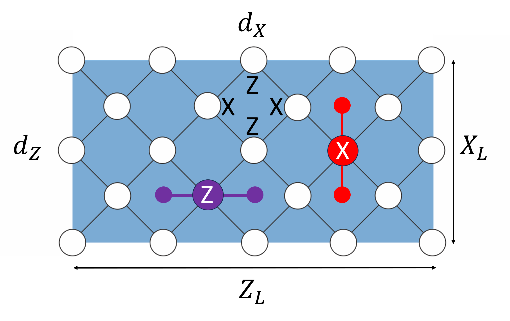
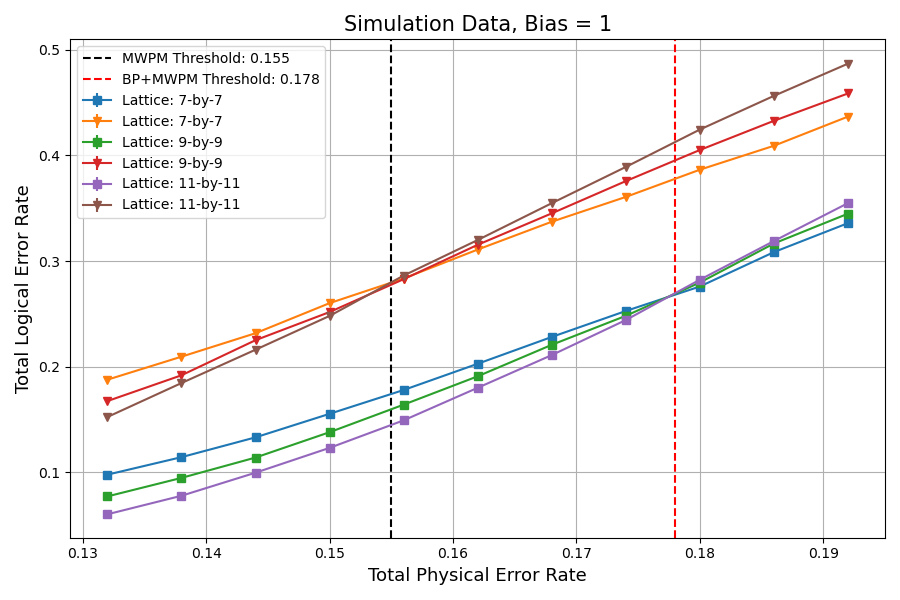
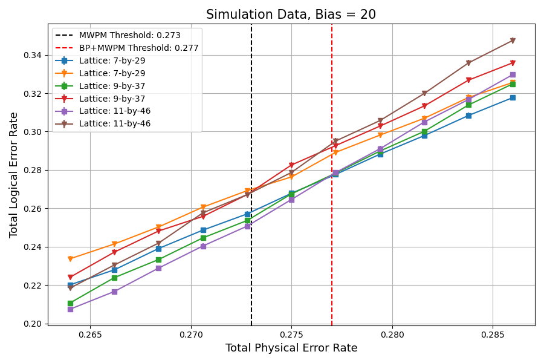
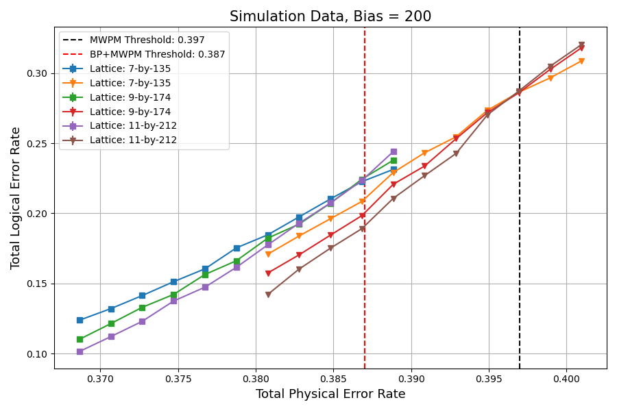
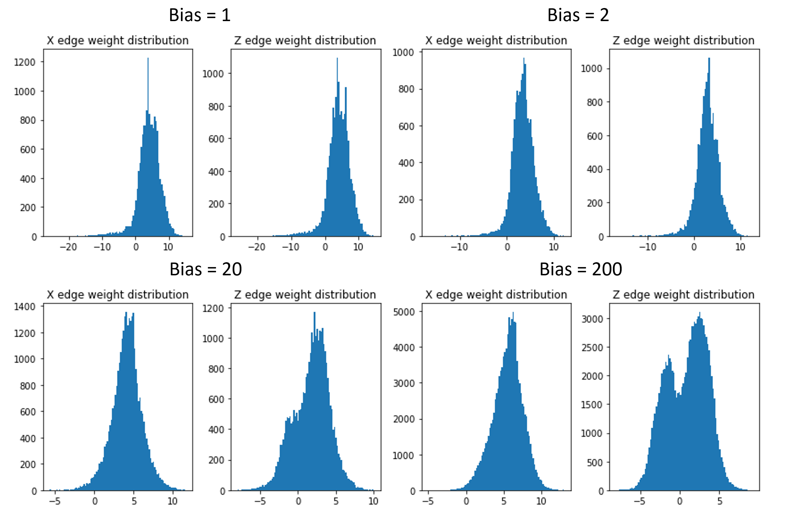

# BP+MWPM-for-XZZX-Code

Jessie Chen (Yale University)

## Introduction

The XZZX surface code is a non-CSS variant of the surface code, with stabilizer checkers given by the Pauli string XZZX [1]. The code achieves significant improvement in performance against biased $X$ or $Z$ noise compared to the toric code [2, 3]. This is accomplished with a built-in symmetry for $X$ and $Z$ noise: the error chains created by $X$ noise are mutually orthogonal with those of $Z$ noise. Thus, with the growth of the bias, the code decouples in the two orthogonal directions and behaves more like stacks of repetition codes. In particular, we consider the XZZX surface code on an open-boundary rectangular lattice. Under this choice of geometry, the stacks of repetition codes have the same length in each direction and the simulation results are affected less by finite-size effects. 

A popular choice of decoders for surface codes is the minimum-weight perfect matching (MWPM) decoder [4-6]. There have also been attempts to incorporate machine learning to improve the performance of the MWPM decoder. In this project, we consider combining belief propagation (BP) with MWPM as a new decoder for the XZZX surface code. 

The first step in BP+MWPM employs BP, a standard algorithm for decoding classical low density parity check (LDPC) codes [7-9], which takes the corrupted surface code as a Tanner graph and compute the error probability of each qubit given a measured syndrome. BP’s result is exact if the topology of the graph is a tree [7]. Since the XZZX surface code decouples into stacks of repetition codes under pure biased noise, it is reasonable to assume that BP can further facilitate MWPM’s performance under high biases. Moreover, BP’s time complexity scales linearly with the block length. Therefore, adding BP to MWPM does not resulting in a drastic computation overhead. 

While BP shows great performance on classical LDPC codes, quantum LDPC codes possess quantum degeneracy, which often leads to loopy structures in the corresponding Tanner graph. BP fails in face of high-density loopy structures. Thus, MWPM is added as a post-processing routine to remedy the issue. 

In the rest of the document, we explain how to set up the code base and its code structure. Then, we present some simulation results for the BP+MWPM decoder across different noise biases and discuss some potential issues for the decoder. It is found that the BP+MWPM decoder exhibits improvements from the MWPM decoder at small biases. However, for high biases, contrary to the theoretical prediction, BP+MWPM exhibits poorer performance. We investigate the cause of this discrepancy and attribute it to the increasing proportion of negative weights on the syndrome graph for MWPM. The use of activation functions to remap the negative weights is proposed to mitigate the problem. 

## How-To-Run

The project is developed under `x86-64` Linux. The system dependencies are as follows:

- `conda`: Anaconda or Miniconda, for managing the appropriate Python virtual environment

To install the Python dependencies, run

```
conda env create -f environment.yml
```

at the root directory of the folder, followed by

```
conda activate bp-mwpm-xzzx
```

to activate the virtual environment.

The code base makes use of Blossom V, which cannot be distributed publicly per its license requirements [5]. To run the code base on a private basis, 

- Download Blossom V `blossom5-v2.05.src.tar.gz` from [here](https://pub.ista.ac.at/~vnk/software.html). 
- Download the Python wrapper from [here](https://qecsim.github.io/_downloads/c84e1d9ff21f4d59490b4e93cf68b494/blossom5-v2.05.pyw.tar.gz). 
- Build the C++ library `libpypm.so` with Blossom V and the Python wrapper. 
- Copy `libpypm.so` to the location `bin\libpypm.so` from the root directory. 

### Project structure

- `bin/`: C++ library for MWPM
- `data/`: Results and data files
- `hpc/`: Skeleton code for running simulation on HPCs
- `res/`: Tests and profiling for improving code performance
- `src/`: Source code for BP+MWPM decoder for the XZZX surface code
  - `bp.py`: Implementation of belief propagation
  - `globals.py`: Global variable declarations
  - `mwpm.py`: Implementation of MWPM decoder with Blossom V
  - `noise.py`: Implementation of noise model on the XZZX surface code
  - `tests.py`: Various checks for code correctness
  - `progress.py`: Progress bar for Slack chat
  - `utils.py`: Various utility and plotting code
  - `xzzx.py`: Implementation of the XZZX surface code and driver code
- `demo.ipynb`: Tutorials for running the code base
- `README.md`: this Markdown file
- `environment.yml`: `conda` virtual environment specifications

## Technical Overview

In this work, we consider the XZZX surface code on a rectangular lattice with open boundary conditions. 



As shown above, data qubits rest upon the vertices of the $d_x$ by $d_z$ rectangular lattice. Logical operators $X_L$ and $Z_L$ are placed on the boundaries of the lattice. Stabilizers consisting of the XZZX Pauli strings are supported on each blue tile. Error chains created by $X$ and $Z$ noise are mutually orthogonal. 

The error model under consideration is the site-independent biased Pauli noise on each data qubits. Let $p_x, p_y, p_z$ denote the probability of $X, Y, Z$ Pauli noise respectively, and $\eta > 0$ denote the strength of the bias. The model supports bias in any one of the $X, Y, Z$ Paulis. Let $B \in \{X, Y, Z\}$ be the type of the noise bias with error probability $p$. Then the rest of the two errors are set to both have $p /\eta$ probabilities. For $\eta = 1$, we recover the depolarizing noise channel. For $\eta \rightarrow \infty$, we obtain a pure biased noise in $B$. The total physical error probability $p_{\text{tot}} = p_x + p_y + p_z$. 

By default, MWPM decoders rely solely on error probabilities to deduce the error chains given a set of error syndromes. Again, $X$ and $Z$ noise produce error chains in mutually orthogonal directions, and $Y$ noise can be taken as a product of $X$ and $Z$ noise. Taking multi-path summation [10] into account, the error probability of an error chain $E$ is given as
$$\Pr(E) = \Omega(E) (p_x + p_y)^{w_1(E)}(p_z + p_y)^{w_2(E)}(1 - p_x - p_y - p_z)^{[n - w_1(E) - w_2(E)]} \ \ \ \ \ (1).$$
Here, $\Omega(E)$ is the multiplicative factor from multi-path summation, $w_1(E)$ is the weight of $X$ error edges, $w_2(E)$ is the weight of the $Z$ error edges, and $n$ is the total number of qubits. Given the symmetry of $X$ and $Z$ Paulis on the XZZX surface code, we work with $Z$-biased noise and set $p_x = p_y = p_z / \eta$. With some simple manipulations, 
$$\Pr(E) \propto -\left[\sum_{e_1} |e_1| \ln\left(\frac{1 - 2p_x - p_z}{2p_x}\right) + \sum_{e_2} |e_2| \ln\left(\frac{1 - 2p_x - p_z}{p_z + p_x}\right) - \sum_{e} \ln \Omega(e) \right] \ \ \ \ \ (2),$$
where $e_1 \in \{X \text{ error edges}\}$, $e_2 \in \{Z \text{ error edges}\}$, and $e \in \{\text{error edges of } E\}$. The MWPM decoder uses the probability for each error chain as the distance between two syndromes. By minimizing the overall distance, the MWPM decoder finds a most likely set of error chains corresponding to the given syndrome set. 

BP takes the Tanner graph of the XZZX surface code as input and outputs tailored error probability distributions for each qubit on the surface code. In the Tanner graph, each qubit corresponds to a qubit vertex $q$ and each stabilizer checker corresponds to a check vertex $c$. The graph is initialized with a set of beliefs for each qubit $q$ as $[1 - (p_x + p_y + p_z), p_x, p_y, p_z]$. Then the algorithm updates the beliefs in each round via message-passing among neighboring qubit and check vertices according to the following formulae, 
$$m_{c \rightarrow q}(E_q) \propto \sum_{E_{q'}, \ q' \in n(c) \backslash q} \left(\delta_{s_c, S_c \cdot E_c} \prod_{q' \in n(c) \backslash q} m_{q' \rightarrow c} (E_{q'})\right) \ \ \ \ \ (3),$$ 
$$m_{q \rightarrow c}(E_q) \propto p(E_q) \left(\prod_{c' \in n(q) \backslash c} m_{c' \rightarrow q} (E_{q})\right) \ \ \ \ \ (4). $$
Detailed explanations of these formulae and BP can be found in [11]. Once BP converges (and it does in our case), the belief for each qubit $q$ is updated as
$$b_q(E_q) = p_q(E_q) \prod_{c \in n(q)} m_{c \rightarrow q} (E_q) \ \ \ \ \ (5).$$
The updated beliefs are essentially error probability distributions for each qubit $q$ and in general varies among different qubits. In the BP+MWPM decoder, these qubit-dependent beliefs are used instead of the site-independent error probability, and Eqn (2) subsequently becomes
$$\Pr(E) \propto -\left[\sum_{e_1} |e_1| \ln\left(\frac{1 - 2p_x^{(e_1)} - p_z^{(e_1)}}{2p_x^{(e_1)}}\right) + \sum_{e_2} |e_2| \ln\left(\frac{1 - 2p_x^{(e_2)} - p_z^{(e_2)}}{p_z^{(e_2)} + p_x^{(e_2)}}\right) - \sum_{e} \ln \Omega(e) \right] \ \ \ \ \ (6),$$
to take site-dependency into account. For convenience, we denote the $X$ error edge weight for some $e_1$ as $W(X_{e_1})$, and the $Z$ error edge weight for some $e_2$ as $W(Z_{e_2})$. And
$$W(X_{e_1}) = \ln\left(\frac{1 - 2p_x^{(e_1)} - p_z^{(e_1)}}{2p_x^{(e_1)}}\right) \ \ \ \ \ (7),$$
$$W(X_{e_2}) = \ln\left(\frac{1 - 2p_x^{(e_2)} - p_z^{(e_2)}}{p_z^{(e_2)} + p_x^{(e_2)}}\right) \ \ \ \ \ (8).$$
The code base provides three types of decoder: BP, MWPM, and BP+MWPM decoder. The details of choosing decoders and specifying error models can be found in the notebook `demo.ipynb` in the root directory. 

## Results and Discussion

Some simulation across different noise biases are provided below. 








According to the logical error rate and error correction threshold, up to biases of $\sim 10$, the BP+MWPM decoder outperforms the MWPM decoder. However, as the bias further increases, the performance of the MWPM decoder surpasses that of the BP+MWPM decoder. This is against the intuition that BP should perform better at higher biases since the XZZX surface code decouples into stacks of repetition codes. 

A reason for such discrepancy might be the large proportion of negative edge weights from BP at higher biases. MWPM by design can only handle edge weights of one sign. This is not a problem if we use the default formula Eqn (2) for $\Pr(E)$ and limit $0 \leq p_{\text{tot}} < 0.5$. However, in Eqn (6) used by the BP+MWPM decoder, when BP has strong beliefs that certain qubits are experiencing errors but the rest are not, the edge weights in Eqn (7) and (8) split into two signs for different $e_1, e_2$. The default procedure sets edge weights of negative signs to $0$ to ensure all edge weights are non-negative. This countermeasure is a custom adopted by people [12], especially in designs of circuit-level noise decoders. 

However, this naive countermeasure also erases all the information obtained from BP for negative edge weights. This information loss grows with biases. 



As shown above, the proportion of negative edge weights grows with biases. One the one hand, the physical error rate of interest increases with biases; on the other hand, as the XZZX surface code further decouples into stacks of repetition codes, BP’s beliefs about the possible errors on qubits become sharper, resulting in a bimodal distribution at $\eta=200$. With further increasement of the bias, we speculate that the peaks of the bimodal distribution will become smaller. 

Some attempts at recovering the lost information have been made. In particular, we find that by using an activation function [13] of the form 
$$S(W) = \frac{10}{1 + \exp(-0.5(W - 5))} \ \ \ \ \ (9)$$
to remap the edge weights, the error correction threshold up to $\sim 10^2$ for the BP+MWPM decoder can be brought to at least the same level with the MWPM decoder. 

As a side note, we also comment that some naive solutions to the negative edge weight problem do not work. Some people believe that adding an overall shift $\alpha = |\min(\{W\})|$ to all the edge weights can set the minimum of the edge weights to be $0$ and resolve the problem. However, note that in Eqn (6), $\Pr(E)$ is determined by sums of multiple edge weights. This overall shift necessarily penalize longer error chains without a good theoretical reason. In simulations, this solution also does not result in performance improvements. 

## Conclusions and Outlook

In this work, we create a BP+MWPM decoder for the XZZX surface code. Through simulations, we show that it outperforms the usual MWPM decoder up to noise biases of $\sim 10$. We analyze the reason for the deterioration in its performance and attribute it to the growing proportion of negative edge weights and information loss from BP due to naive cut-offs. A form of activation function is proposed to mitigate the information loss. 

Due to various reasons, I stopped pursuing this project actively at some point. At the time of writing, I am no longer obsessed with a particular BP+MWPM decoder. If you are interested in codes and decoders, I suggest looking at these sources [14-16], which gives a better overview of quantum error correcting codes and decoders. 

However, I find the negative edge weight problem to be very fascinating, and it has been at the back of my mind. I present two potential formulations of the problem, whose solutions will resolve the negative weight edge issue (for good or bad). If you are interested in/could teach me something about the problem or want to learn more details about the project, please do not hesitate to contact me at [jessie.zx.chen@gmail.com](jessie.zx.chen@gmail.com). 

### Formulation 1: 

From a graph theory point of view, the difficulty for MWPM to deal with negative edge weights boils down to the negative-weight cycle problem in path-finding algorithms [17]. In the surface code setting, it can be framed as the following: does there exist a polynomial-time (approximate) algorithm for finding shortest simple-paths in a regular (rectangular) graph with negative-weight cycles?

It is known that finding the shortest simple-paths in an arbitrary graph with negative-weight cycles is a NP-hard problem. This is because it can be reduced from the longest-path problem [17]. Suppose that there exists some algorithm $A$ that solves the shortest simple-paths problem on all graphs. Then given a graph $G$ with non-negative edge weights, by negating all edge weights, one can run $A$ on the modified graph to obtain the longest path in $G$. Since the longest-path problem is NP-hard, so is the shortest simple-path problem with negative-weight cycles. 

However, I am not sure whether restraining graph topology would yield a possible polynomial-time algorithm to the problem. Therefore, I have framed the question in the context of regular graphs. 

### Formulation 2: 

Returning back to the issue of remapping the weight distribution function, the problem can be reformulated as: given a (bimodal) distribution $D$ on $\mathbb R$, does there exist a map $M: \mathbb R \rightarrow \mathbb R$ s.t. $M(D)$ is defined on $\mathbb R_{\geq 0}$ and for any two subsets of weights $W_1$ and $W_2$ by $D$, $\sum_{x \in W_1} x \geq \sum_{x \in W_2} x$ iff $\sum_{x \in M(W_1)} x \geq \sum_{x \in M(W_2)} x$?

## Acknowledgement

The author would like to thank Shraddha Singh (Yale Applied Physics) for answering her many questions regarding the details of surface code error correction. She also thanks Allen Mi (Yale Physics) for helping her improve the efficiency of the codes drastically. 

## Sources

\[1]: Bonilla Ataides, J.P., Tuckett, D.K., Bartlett, S.D. *et al.* The XZZX surface code. *Nat Commun* **12**, 2172 (2021). https://doi.org/10.1038/s41467-021-22274-1

\[2]: A. Y. Kitaev, Fault-tolerant quantum computation by anyons. *Annals Phys*. **303**, 2 (2003). https://arxiv.org/abs/quant-ph/9707021

\[3]: E. Dennis, A. Kitaev, A. Landahl, and J. Preskill, *J. Math.Phys*. **43**, 4452 (2002), https://arxiv.org/abs/quant-ph/0110143

\[4]: Edmonds, J. (1965). Paths, Trees, and Flowers. *Canadian Journal of Mathematics,* *17*, 449-467. doi:10.4153/CJM-1965-045-4

\[5]: Kolmogorov, V. Blossom V: a new implementation of a minimum cost perfect matching algorithm. *Math. Prog. Comp.* **1**, 43–67 (2009). https://doi.org/10.1007/s12532-009-0002-8

\[6]: A. G. Fowler, Minimum weight perfect matching of fault-tolerant topological quantum error correction in average o(1) parallel time (2014), https://arxiv.org/abs/1307.1740

\[7]: D. J. C. MacKay, *Information Theory, Inference and Learning Algorithms*, Cambridge University Press, Cambridge, UK, October 2003.

\[8]: Y.-H. Liu and D. Poulin, Neural Belief-Propagation Decoders for Quantum Error-Correcting Codes, *Physical Review Letters* **122**, (2019). https://journals.aps.org/prl/abstract/10.1103/PhysRevLett.122.200501

\[9]: P. Panteleev and G. Kalachev, Degenerate Quantum LDPC Codes With Good Finite Length Performance, *Quantum* **5**, 585 (2021). https://quantum-journal.org/papers/q-2021-11-22-585

\[10]: B. Criger and I. Ashraf, Multi-path Summation for Decoding 2D Topological Codes, *Quantum* **2**, 102 (2018). https://arxiv.org/abs/1709.02154

\[11]: D. Poulin and Y. Chung, On the iterative decoding of sparse quantum codes (2008). https://arxiv.org/abs/0801.1241

\[12]: Private communication with Shraddha Singh.

\[13]: I. J. Goodfellow, Y. Bengio, and A. Courville, *Deep Learning*, MIT Press, Cambridge, MA, USA, 2016. http://www.deeplearningbook.org

\[14]: N. P. Breuckmann and J. N. Eberhardt, Quantum Low-Density Parity-Check Codes, *PRX Quantum* **2** (2021). https://journals.aps.org/prxquantum/abstract/10.1103/PRXQuantum.2.040101

\[15]: Google Quantum AI. Suppressing quantum errors by scaling a surface code logical qubit. *Nature* **614**, 676–681 (2023). https://doi.org/10.1038/s41586-022-05434-1

\[16]: Error Correction Zoo. https://errorcorrectionzoo.org/

\[17]: J. Kleinberg and E. Tardos, Algorithm Design, Addison-Wesley Longman Publishing Co., Inc., USA, 2005.


